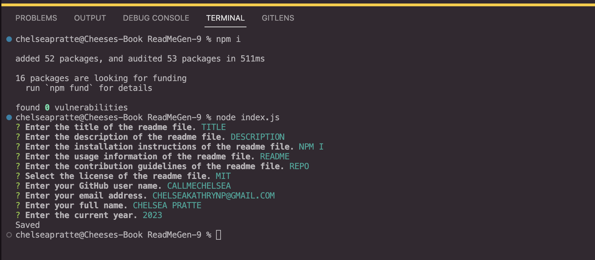

# ReadMeGen-9
node js app that generates a readme file

## Description
This app will generate a ReadMe file after the user has completed the question prompt. To use this app you must have node js installed and have the inquirer package downloaded.

## Video Walkthrough
(https://drive.google.com/file/d/1gM27bfF_UDkuP4laqF3QmCmQQF30bri7/view)

## Installation
You will need node js and the inquirer package

## Usage Information
Application can be used by running node index.js in the terminal
